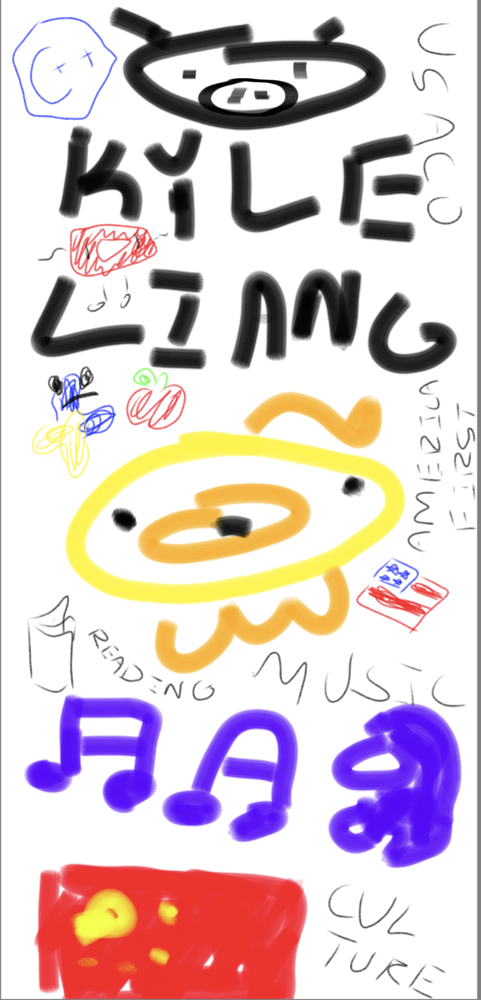

<!-- TOC Here -->

## Kyle Liang's Blog
I'm Kyle Liang, and this is my GitHub Blog :D I do USACO.

## My Hobbies
>- **Coding**: I do USACO. I hope I get into USACO Gold soon. Also I do CodeForces, and I have a Romanian Tutor.
- **Music**: I play a lot of piano ;-; Also, I like listening to music :P
- **Reading**: I try to read a lot. Um, but most of the time I just watch youtube. You should read (12 Rules for Life: An Antidote to Chaos)[https://a.co/d/7JdgU8o],  

## A Poem
>"First they came for the **socialists**, and I did not speak out—because I was not a **socialist**.
>
>Then they came for the **trade unionists**, and I did not speak out—because I was not a **trade unionist**.
>
>Then they came for the **Jews**, and I did not speak out—because I was not a **Jew**.
>
>Then they came for **me**—and there was no one left to speak for **me**."
>
>***—Martin Niemöller***

## Motivation
>At dawn, when you have trouble getting out of bed, tell yourself: “I have to go to work — as a human being. What do I have to complain of, if I’m going to do what I was born for — the things I was brought into the world to do? Or is this what I was created for? To huddle under the blankets and stay warm?”
>
>So you were born to feel “nice”? Instead of doing things and experiencing them? Don’t you see the plants, the birds, the ants and spiders and bees going about their individual tasks, putting the world in order, as best they can? And you’re not willing to do your job as a human being? Why aren’t you running to do what your nature demands?

## Freeform Drawing

